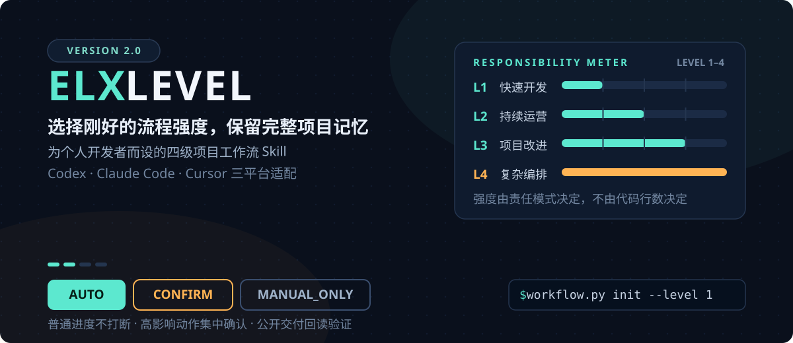
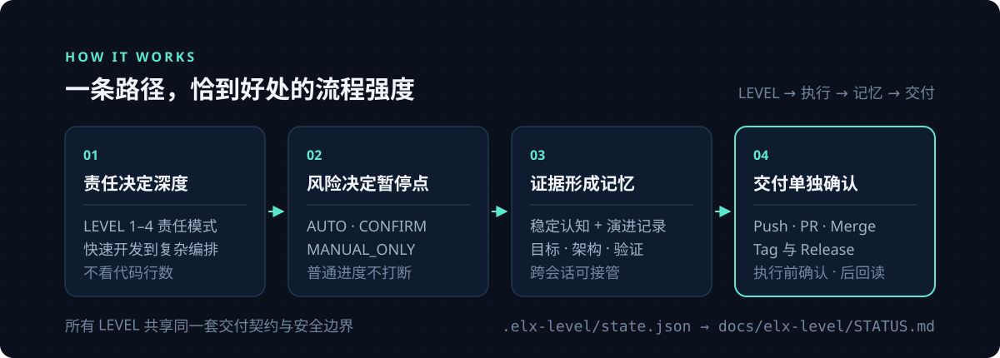
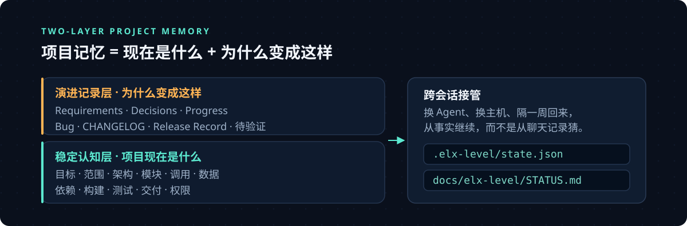

# ELX Level

<p align="right"><a href="README.en.md">🌐 English</a></p>

<div align="center">




**为个人开发者而设的四级项目工作流 Skill。**
让 LEVEL 1 / LEVEL 2 优先，把普通进度留在 `AUTO`，只在真正重要的决定前进入 `CONFIRM` 或 `MANUAL_ONLY`。

[✨ 解决什么问题](#-它解决什么问题) · [⚡ 快速开始](#-3-分钟快速开始) · [🎚️ 四级模型](#-四级模型按责任选强度) · [🧠 项目记忆](#-双层项目记忆) · [🛡️ 安全边界](#-安全边界与-github-交付-gate) · [📖 LEVEL.md](LEVEL.md)

</div>

## ✨ 它解决什么问题

AI 结对开发最常见的三个烦恼：

- 🫥 **会话一断，上下文全丢** —— 新会话只能从聊天记录里猜项目现状。
- 🎚️ **流程强度不好选** —— 太轻留不下可接管的记忆，太重则每一步都在审批。
- 🚦 **公开交付没人把关** —— Push、PR、Merge、发布缺少统一的确认与验证关口。

ELX Level 的答案：用**责任模式**决定流程强度 —— 先判断项目由谁负责、承担什么责任，再决定 AI 在哪里自动推进、在哪里停下确认；用**双层项目记忆**让每个新会话都能从事实继续；为所有公开交付设置**同一道 GitHub Gate**。

## ⚡ 3 分钟快速开始

下面以 Windows、Codex、项目级安装和 LEVEL 1 为例。先审查 Dry Run；确认 LEVEL 后，再初始化项目。

```powershell
# ① 克隆本仓库
git clone https://github.com/Ee1ex/elx-level.git
Set-Location elx-level

# ② 先 Dry Run 审查，再正式安装
$ProjectPath = 'D:\path\to\your-project'
./scripts/install.ps1 -Platform codex -Scope project -ProjectPath $ProjectPath -DryRun
./scripts/install.ps1 -Platform codex -Scope project -ProjectPath $ProjectPath

# ③ 初始化 LEVEL 1，并查看状态
python "$ProjectPath\.codex\skills\elx-level\scripts\workflow.py" init --project $ProjectPath --level 1
python "$ProjectPath\.codex\skills\elx-level\scripts\workflow.py" status --project $ProjectPath
```

初始化会建立 `.elx-level/state.json` 和 `docs/elx-level/STATUS.md`。其他平台与安装范围见 [📦 安装到你的平台](#-安装到你的平台)；四个 LEVEL 的完整规则以 [`LEVEL.md`](LEVEL.md) 为唯一权威源。

## 🎚️ 四级模型：按责任选强度

| LEVEL | 🧭 责任模式 | 🎯 适合什么项目 | ⚙️ 默认做法 |
| :---: | --- | --- | --- |
| **1** 🚀 | 快速开发与完整项目记忆 | 离线工具、脚本、Skill、插件、Mod、原型、静态页面、版本化下载物 | 实现 → 运行 → 观察 → 调整；小改动只留轻量记录 |
| **2** 🛰️ | 完整 PVS 持续运营 | 自己负责账户、权限、云端数据、服务、部署、备份、回滚、监控或支持 | 全量包内 PVS；`Phase 0 → Phase N`、范围冻结和 DoD，普通 Phase 完成后自动继续 |
| **3** 🤝 | 已有、团队与开源项目改进 | 参与他人、团队、公司或开源仓库 | 复用 Issue、PR、CHANGELOG、ADR；只补项目地图、Change Record、基线、回归与交接 |
| **4** 🎛️ | 复杂自动化参考与路由 | 大型产品、多系统编排、复杂自动化和多人协作 | 先分析，负责人确认后可实施；十节点作参考，外部专业 Skill 只路由、不内嵌 |

**选择顺序**以 [LEVEL.md](LEVEL.md) 为唯一权威：参与他人贡献流程 → 复杂系统边界分析 → 自有持续运营 → 离线/静态交付。项目等级不替代本次任务的记录粒度。

> 💡 **“以后会更新” ≠ “持续运营”。** 重新打包或上传静态版本通常仍是 LEVEL 1；只有长期承担可用性、用户、权限、数据、发布和支持责任时，才进入 LEVEL 2。

## ⚙️ 它如何工作



1. **责任决定深度。** 先判断你是在快速构建、持续运营、改进已有仓库，还是编排复杂自动化。
2. **风险决定暂停点。** LEVEL 1–3 对用户只展示 `AUTO`、`CONFIRM`、`MANUAL_ONLY`；普通实现、测试和本地提交不形成 Gate。
3. **证据形成记忆。** 目标、架构和当前事实保持稳定；决定、修改和验证持续累积，下一次可以从事实继续。
4. **公开交付单独确认。** 按需执行远端动作，执行前集中确认，完成后远端回读验证。Codex 优先 GitHub 插件，其他平台可声明已有且获准的连接器或 CLI；Tag 与 Release 遵循仓库约定。

## 🧠 双层项目记忆



项目记忆不是文档数量，而是两类信息都能被接管：

- 🏛️ **稳定认知层**回答“项目现在是什么”：目标、范围、核心路径、架构、模块、调用、数据、依赖、构建、测试和交付。
- 📈 **演进记录层**回答“为什么变成这样”：Requirements、Decisions、Progress、Bug、CHANGELOG、Release Record 和验证证据。

LEVEL 1 同时建立两层记忆，但小功能、小修改只需要 Progress/Changelog 或轻量 Change Record。LEVEL 2 全量采用包内 PVS，覆盖产品、需求、决策、业务流、UI、架构、API、数据、权限、部署、监控、备份、回滚、运营、Bug、待验证和版本记录。LEVEL 3 优先复用仓库既有事实，不另建平行文档树。

完整治理规则和 starter 模板内嵌在 [`core/project-vibe-spec/PVS.md`](core/project-vibe-spec/PVS.md)，职责映射见 [`templates/template-map.json`](templates/template-map.json)；安装本包不需要再下载第二个 PVS Skill。

## 🛡️ 安全边界与 GitHub 交付 Gate

⛔ **以下动作始终需要确认**：批量删除、生产数据、密钥、支付、账号权限、不可逆迁移、安全降级、生产部署、公开发布、对外发送、Merge 和 Release。

🚫 **永久禁止**：Force Push、改写公共历史。

🔁 **所有 LEVEL 的 GitHub 交付使用同一契约**：插件先只读核对远端，给出分支、提交、文件范围、测试证据、PR、Merge、Tag/Release、回滚和未验证项，再请求一次远程操作确认。**成功提示不等于完成** —— 必须通过所选工具回读结果；Codex 优先使用 GitHub 插件，其他平台可声明同等治理的替代工具。

## 📦 安装到你的平台

支持 Codex、Claude Code 和 Cursor：

```powershell
./scripts/install.ps1 -Platform codex -Scope user -DryRun
./scripts/install.ps1 -Platform cursor -Scope project -ProjectPath 'D:\path\to\project' -DryRun
```

```sh
./scripts/install.sh --platform claude-code --scope user --dry-run
./scripts/install.sh --platform claude-code --scope user
```

适配器只引用当前 LEVEL、状态和分层策略，不复制完整流程。更新器会先运行 Doctor，并在替换新安装前显式迁移项目状态和创建时间戳备份；卸载器只移除 `elx-level`，默认保留 `.elx-level/`、`docs/elx-level/`、旧 `.project-workflow/` 和旧 Skill 安装。

## 🔄 从旧版本迁移

- 📦 `migrate` 会把旧 `.project-workflow` 完整复制到 `.elx-level`，保留旧目录不变；已迁移且来源摘要匹配时允许并存；没有对应记录或来源变化时停止且不覆盖。
- 🔢 `0.4.0` 的 LEVEL 1–4 保持原数字，其中旧 LEVEL 4 仍停在分析边界并等待执行确认；更老状态按协议迁移：旧 LEVEL 1 → 新 LEVEL 1、旧 LEVEL 2 → 新 LEVEL 3、旧 LEVEL 3 → 新 LEVEL 4。
- 💾 迁移前会写入 `state.backup.json`，并在 `STATUS.md` 记录旧/新版本、等级和原因。

当前公共版本为 `2.1`，本仓库不创建 GitHub Release，Git Tag 保持现状；未发布改进见 CHANGELOG。

## 🗂️ 仓库结构

```text
elx-level/
├── 📄 SKILL.md                 # Skill 入口与触发规则
├── 📄 LEVEL.md                 # 四级模型唯一权威文档
├── 📁 adapters/                # Codex · Claude Code · Cursor 适配器
├── 📁 core/project-vibe-spec/  # 包内 PVS 治理内核
├── 📁 references/              # 状态协议 · 风险权限 · 路由契约
├── 📁 templates/               # level1–4 + common 模板
├── 📁 schemas/                 # workflow-state.schema.json
├── 📁 scripts/                 # workflow.py · install/update/uninstall
├── 📁 evals/ · tests/          # 中文场景评测与单元测试
└── 📁 assets/readme/           # README 视觉素材
```

## 🧪 开发与验证

开发验证只依赖 Python 3.10+ 标准库：

```sh
python -m unittest discover -s tests -v
python scripts/workflow.py doctor --package-root .
python scripts/workflow.py validate-package --package-root .
```

## 📄 许可证

本项目采用 [MIT License](LICENSE)。

<div align="center">
<sub><b>ELX Level</b> —— 选择刚好的流程强度，保留完整项目记忆 · <a href="#-elx-level">⬆ 返回顶部</a></sub>
</div>

方案 B（未发布）：按任务影响选择记录粒度；替换安装前校验暂存包；验证证据绑定当前任务和内容。完整规则与示例见 [文档契约](references/documentation-contract.md) 和 [使用场景](references/usage-examples.md)。
